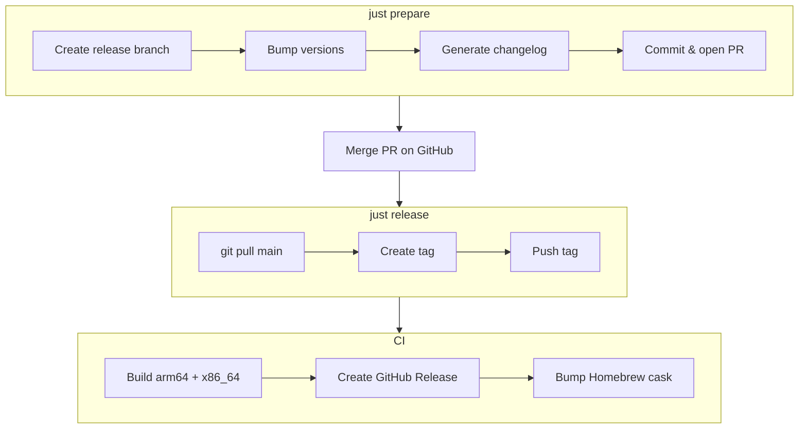

# Penpal

A desktop app and local web server that **only** operates on markdown files inside `thoughts/` directories. It auto-discovers projects containing a `thoughts/` directory and provides a UI for browsing, searching, and collaboratively reviewing the documents within.

**This is NOT a code review tool.** Penpal is for reviewing _documentation_ -- research, plans, guides, and other markdown artifacts that AI agents generate in `thoughts/` directories.

## Features

- Auto-discovers projects with `thoughts/` directories
- Flat file view with research/plan type badges
- Full-text search across all files
- Rendered markdown with syntax highlighting and mermaid diagrams
- Git branch and status display
- **Comment threads** anchored to specific text in documents (like Google Docs)
- **Review workflow** -- agents can request review, humans leave comments, agents respond
- **MCP server** at `/mcp` for AI agents to participate in document review programmatically
- **Agent presence** -- shows when an agent is actively monitoring a file

## Install

### Homebrew (recommended)

```bash
brew install --cask block/tap/penpal
```

On first launch, Penpal will prompt you to install the CLI and Claude Code plugin.

### Build from source

For development, you can build and install locally. Requires Go, Node.js, Rust, and [just](https://github.com/casey/just).

```bash
just install       # Build dev-branded .app and copy to /Applications
```

Dev builds show "Penpal Dev" in the menu bar so you can distinguish them from Homebrew installs.

### CLI

```bash
penpal open thoughts/shared/plans/my-doc.md   # Open file in Penpal desktop app
```

## Development

| Command | Description |
|---|---|
| `just dev` | Desktop app with Vite HMR + Go sidecar |
| `just build` | Build sidecar + frontend + desktop `.app` bundle |
| `just build-go` | Build Go sidecar binaries for desktop app |
| `just package` | Build + zip `.app` for distribution |
| `just test` | Run all tests (Go + React) |
| `just test-e2e` | Playwright end-to-end tests |
| `just fmt` | Format Go code |
| `just clean` | Remove build artifacts |

### Releasing

```bash
just prepare 0.2.0   # Bump version, generate changelog, open release PR
# Merge the PR on GitHub
git pull
just release 0.2.0   # Tag and push → CI builds and publishes
```

`just prepare` creates a release branch, updates the version in `Cargo.toml` and `package.json`, generates a changelog entry using Claude, and opens a PR. After the PR is merged, `just release` creates a `penpal/v*` tag and pushes it to trigger the CI release pipeline.



### Server options

```bash
./penpal -port 3000              # Custom API port (default: 8080)
```

## [Changelog](CHANGELOG.md) | [Roadmap](ROADMAP.md)
