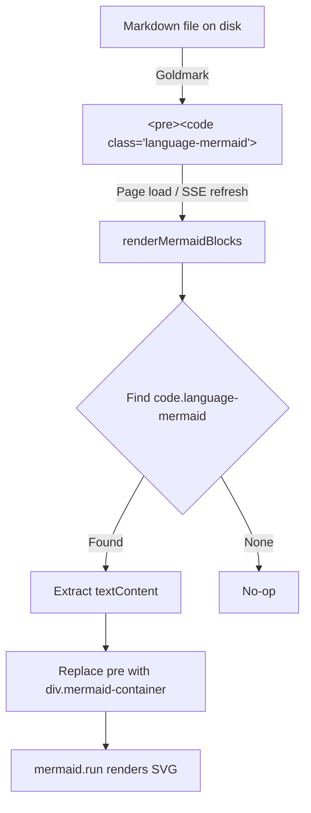

# Mermaid Diagram Rendering

**Status:** Implemented
**Area:** Frontend rendering

Penpal renders mermaid diagrams inline when viewing markdown files. Any fenced code block tagged with `mermaid` is converted from raw text into an SVG diagram.

## How it works

## Pipeline

1. **Server-side**: Goldmark parses the markdown and produces a `<pre><code class="language-mermaid">` block, just like any other fenced code block. Chroma syntax highlighting runs but has no effect on mermaid content.

2. **Client-side**: After the page loads, `renderMermaidBlocks()` walks the rendered content looking for `code.language-mermaid` elements. For each one it:
   - Extracts the raw text from the code element
   - Creates a `div.mermaid-container` wrapper (preserving `data-source-line` for comment anchoring)
   - Inserts a `div.mermaid` with the diagram source
   - Calls `mermaid.run()` to render SVGs

3. **Live updates**: When a file changes on disk, SSE triggers `refreshDocument()` which replaces the content HTML and re-runs `renderMermaidBlocks()`.
